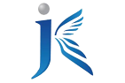

	
		

			<h1>Skills</h1>
			
	
				Below is a quick overview of my main technical skill sets and tools I use.
			

		

		       
	

	
			

				

					<h3> Unity, C#</h3>
					Newbie 📘  
					   
					
					

						2019년부터 여러 AR/VR 프로젝트를 진행하며 실력을 쌓아왔습니다. 꾸준한 개발을 통해 실력을 더 쌓을 수 있다고 생각합니다.
					

				

			

				
							
					<h3> C</h3>
					1-2 years of experience 💪    

					

						유닉스 시스템으로 간단한 데이터베이스를 만들고 레코드를 추가, 검색, 삭제하는 프로그램을 만들었습니다.
					

				

			
			
			
				
		
					<h3> JAVA</h3>
					Newbie 📘    

					

						자바스윙을 이용한 로또 추첨 프로그램과,  운영체제 프로세스 중 SRT(Shortest Remaining Time) 스케줄링 알고리즘을 구현한 경험이 있습니다.
					

				

			
			
			
				
		
					<h3> HTML</h3>
					Newbie 📘    

					

						학교 프로젝트로, 이클립스와 아파치 톰캣을 이용하여 커뮤니티 홈페이지를 만든 경험이 있습니다.
					

				

			

	
		
	
		

			

				<h3> C++</h3>

				

					간단한 계산기 프로그램,  큐스택을 이용한 입출력 프로그램을 만들었습니다.
				

			

		
			

				<h3>ANDROID PROGRAMMING</h3>

				

					기본적인 레이아웃 배치법,  메뉴, 옵션 버튼 구현
				

			

		
		
		
		

	

	

	
		

			<h1>Experiences</h1>

		

		     

		

			
		
				

			

				
			
		
			
				<h5>educational student [교육생]</h5>
				<h5>
					<a href="https://www.uokdc.com/">Kukje vocational school, 국제직업전문학교</a>
				</h5>
				<I>	May, 2019 - Nov, 2019 • 6 mos</I>  
				<I>	Gwangju, Korea</I>    
				6개월동안 vr/ar 전문가 양성과정으로  
				Unity와 Unreal Engine, 포토샵·일러스트·3ds Max를 배웠습니다.

			

							
		

		
		   
		
		
		

			
		
				

			

				
			
		
				<h5>Trainee</h5>
				<h5><a href="https://www.uokdc.com/">UOK</a></h5>
				<I>	Jul, 2019 - Nov, 2019 • 4 mos</I>  
				<I>	Gwangju, Korea</I>    
				(주)유오케이에서 실습생으로 여러 AR/VR 프로젝트( 송정역 시장 AR STREET,  
				곡성 신흥마을 AR MAP,  VR 어트랙션 롤러코스터 )에 참여했습니다.
			

							
		

	

